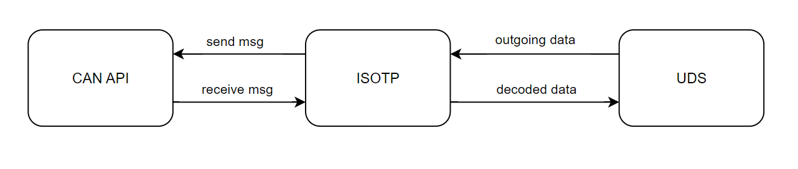

# Busmaster UDS & ISOTP Implementation

# Table of contents
1. [Introduction](#bullet1)
2. [Pre-Requisites](#bullet2)
    1. [Busmaster](#bullet2-subBullet1)
    2. [TDM-GCC](#bullet2-subBullet2)
    3. [Make](#bullet2-subBullet3)
3. [Implementation Details](#bullet3)
    1. [Sub-Bullet Point](#bullet3-subBullet1)

## Introduction 
This project is a UDS and ISOTP implementation to be used with Busmaster for vehicle debugging and diagnostics. This readme only documents installation for 64-bit Windows 10 host computer.

## Pre-Requisites 
The following pre-requisites are required to be able to compile and use the tool.

### Busmaster 
This is a sub paragraph, formatted in heading 3 style

https://rbei-etas.github.io/busmaster/

### TDM-GCC 

TDM-GCC 4.8.1 can be dowloaded from the sourceforge link below. It is critical that version 4.8.1 is downloaded since Busmaster will not compile with any other versions.

https://sourceforge.net/projects/tdm-gcc/files/TDM-GCC%20Installer/Previous/1.1309.0/tdm-gcc-4.8.1.exe/download

### Make 
download and install make using the following instructions

## Implementation Details 

### Block Diagram 

### ISOTP State Machine 

### UDS State Machine 
